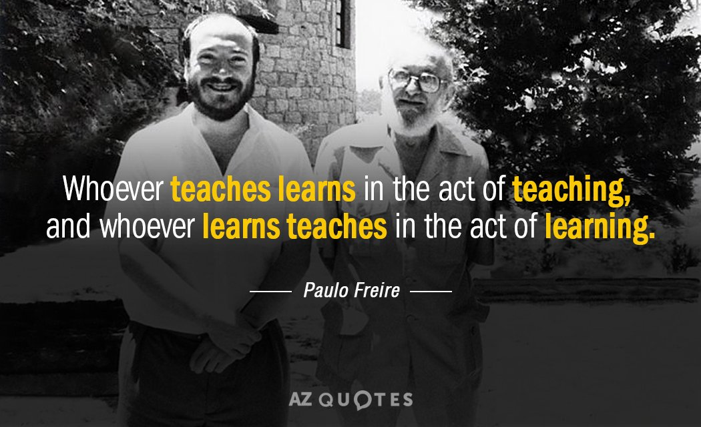

# 🎾 Syed Alam

<text style="font-style: italic"> Whoever teaches learns in the act of teaching and whoever learns teaches in the act of learning.</text>
 
<text> Paul Freire </text>
  <!--  -->

### Hi there 👋

<!--
**smzalam/smzalam** is a ✨ _special_ ✨ repository because its `README.md` (this file) appears on your GitHub profile.

Here are some ideas to get you started:

- 🔭 I’m currently working on ...
- 🌱 I’m currently learning ...
- 👯 I’m looking to collaborate on ...
- 🤔 I’m looking for help with ...
- 💬 Ask me about ...
- 📫 How to reach me: ...
- 😄 Pronouns: ...
- ⚡ Fun fact: ...
-->
